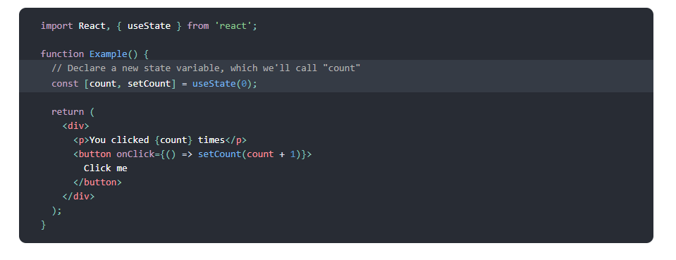
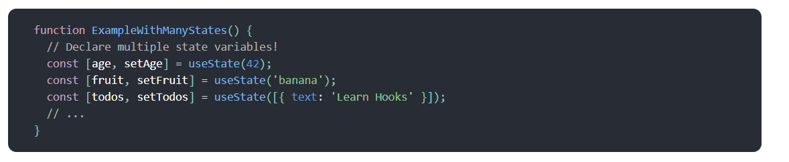
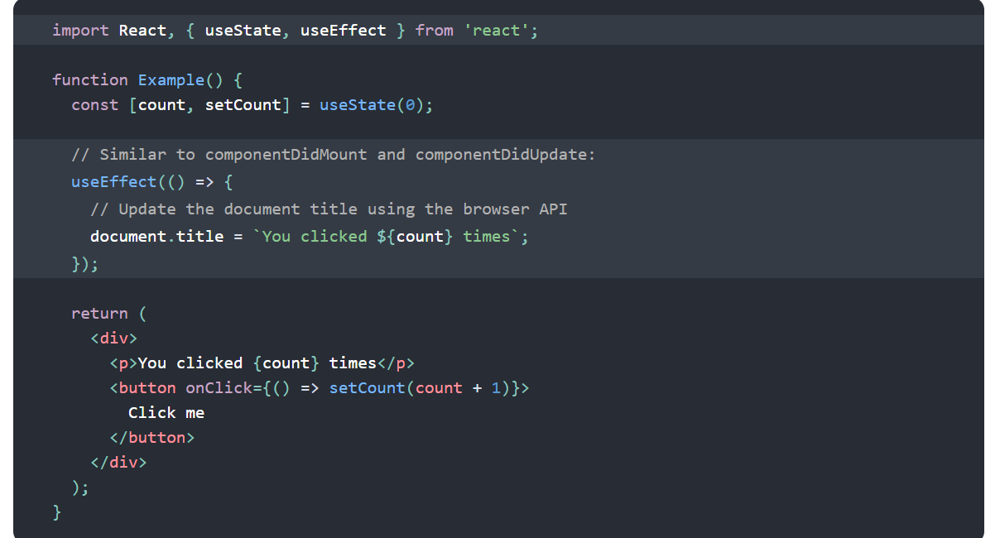

# Introducing Hooks
## Hooks are a new addition in React 16.8. They let you use state and other React features without writing a class.

### This new function useState is the first “Hook” we’ll learn about, but this example is just a teaser. Don’t worry if it doesn’t make sense yet!
## Note
# React 16.8.0 is the first release to support Hooks. When upgrading, don’t forget to update all packages, including React DOM. React Native has supported Hooks since the 0.59 release of React Native
Hooks are a new addition in React 16.8. They let you use state and other React features without writing a class.

#### This example renders a counter. When you click the button, it increments the value:

Here, useState is a Hook (we’ll talk about what this means in a moment). We call it inside a function component to add some local state to it. React will preserve this state between re-renders. useState returns a pair: the current state value and a function that lets you update it. You can call this function from an event handler or somewhere else. It’s similar to this.setState in a class, except it doesn’t merge the old and new state together. (We’ll show an example comparing useState to this.state in Using the State Hook.)

The only argument to useState is the initial state. In the example above, it is 0 because our counter starts from zero. Note that unlike this.state, the state here doesn’t have to be an object — although it can be if you want. The initial state argument is only used during the first render.

# Declaring multiple state variables
## You can use the State Hook more than once in a single component:

The array destructuring syntax lets us give different names to the state variables we declared by calling useState. These names aren’t a part of the useState API. Instead, React assumes that if you call useState many times, you do it in the same order during every render. We’ll come back to why this works and when this is useful later.

# But what is a Hook?
## Hooks are functions that let you “hook into” React state and lifecycle features from function components. Hooks don’t work inside classes — they let you use React without classes. (We don’t recommend rewriting your existing components overnight but you can start using Hooks in the new ones if you’d like.)

React provides a few built-in Hooks like useState. You can also create your own Hooks to reuse stateful behavior between different components. We’ll look at the built-in Hooks first.

## When you call useEffect, you’re telling React to run your “effect” function after flushing changes to the DOM. Effects are declared inside the component so they have access to its props and state. By default, React runs the effects after every render — including the first render. (We’ll talk more about how this compares to class lifecycles in Using the Effect Hook.)

Effects may also optionally specify how to “clean up” after them by returning a function. For example, this component uses an effect to subscribe to a friend’s online status, and cleans up by unsubscribing from it

## useEffect
React useEffect is a function that gets executed for 3 
different React component lifecycles.
Those lifecycles are componentDidMount, 
componentDidUpdate, and componentWillUnmount 
lifecycles

# Rules to Remember
Don’t call Hooks inside 
loops, conditions, or nested 
functions. Instead, always 
use Hooks at the top level of 
your React function, before 
any early returns